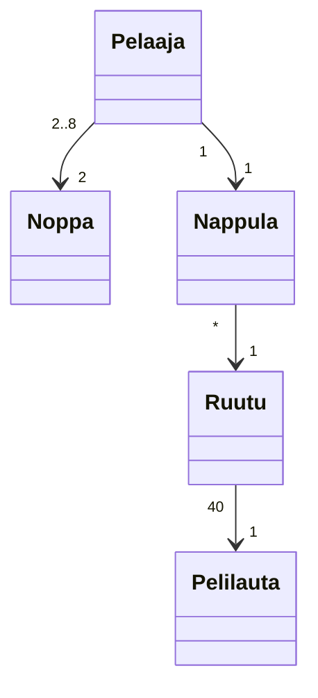

```mermaid
classDiagram
	Pelaaja "2..8" --> "2" Noppa
	Pelaaja "1" --> "1" Nappula
	Nappula "*" --> "1" Ruutu
	Ruutu "40" --> "1" Pelilauta
	class Pelaaja{}
	class Noppa{}
	class Nappula{}
	class Ruutu{}
	class Pelilauta{}
```
